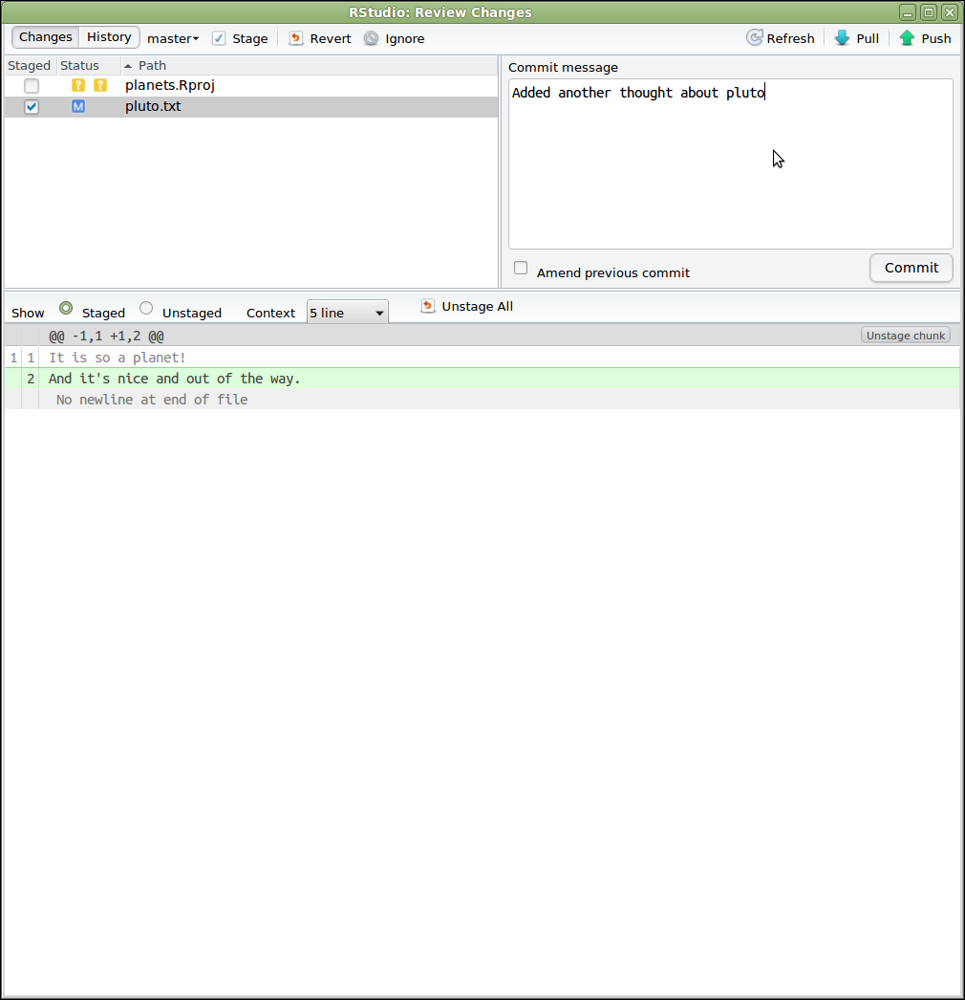

Since version control is so useful when developing scripts, RStudio has built-in
integration with Git. There are some more obscure Git features that you still
need to use the command-line for, but RStudio has a nice interface for most
common operations.

RStudio let's you create a [project][rstudio-projects] associated with
a given directory. This is a way to keep track of related files. One
of the way to keep track of them is via version control! To get
started using RStudio for version control, let's make a new project:

This will pop up a window asking us how we want to create the project. We have
some options here. Let's say that we want to use RStudio with the planets
repository that we already made. Since that repository lives in a directory on
our computer, we'll choose "existing directory":

> ## Do You See a "Version Control" Option?
>
> Although we're not going to use it here, there should be a "version control"
> option on this menu. That is what you would click on if you wanted to
> create a project on your computer by cloning a repository from GitHub.
> If that option is not present, it probably means that RStudio doesn't know
> where your Git executable is. See
> [this page](https://stat545-ubc.github.io/git03_rstudio-meet-git.html)
> for some debugging advice. Even if you have Git installed, you may need
> to accept the XCode license if you are using macOS.
{: .callout}

Next, RStudio will ask which existing directory we want to use. Click "browse"
to navigate to the correct directory on your computer, then click "create
project":

Ta-da! Now you have an R project containing your repository. Notice the
vertical "Git" menu that is now on the menu bar. This means RStudio has
recognized that this directory is a git repository, so it's giving you tools
to use Git:

To edit the files in your repository, you can click on them from the panel in
the lower right. Let's add some more information about Pluto:

Once we have saved our edited files, we can also use RStudio to commit these changes. Go to the git menu and click
"commit":

This will bring up a screen where you can select which files to commit (check
the boxes in the "staged" column) and enter a commit message (in the upper
right). The icons in the "status" column indicate the current status of each
file. You can also see the changes to each file by clicking on its name. Once
everything is the way you want it, click "commit":

You can push these changes by selecting "push" from the Git menu. There are
also options there to pull from a remote version of the repository, and view
the history:

> ## Are the Push/Pull Commands Grayed Out?
>
> If this is the case, it generally means that RStudio doesn't know the
> location of any other version of your repository (i.e. the one on GitHub).
> To fix this, open a terminal to the repository and enter the command:
> `git push -u origin master`. Then restart RStudio.
{: .callout}

If we click on "history", we can see a pretty graphical version of what
`git log` would tell us:

RStudio creates some files that it uses to keep track of your project. You
generally don't want to track these, so adding them to your `.gitignore` file
is a good idea:

There are many more features buried in the RStudio git interface, but these
should be enough to get you started!

[rstudio-projects]: https://support.rstudio.com/hc/en-us/articles/200526207-Using-Projects
